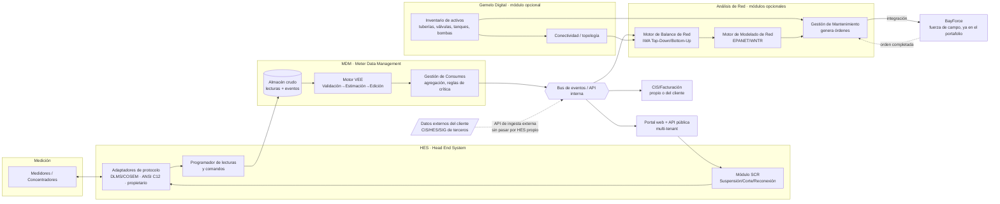

# Arquitectura General — RenfyGrid (MDM/AMI)

**Fecha:** 2026-09-09 · **Estado:** Fase 2 de 4 (Planteamiento ✅ → **Arquitectura general** → Diseño → Plan de sprints)
Basado en `01-planteamiento.md` (SaaS multi-tenant como modelo primario, energía eléctrica
como utility inicial, adaptadores futuros para agua/gas).

---

## 1. Principios rectores

1. **Núcleo agnóstico de protocolo/utility.** El HES y el MDM no conocen los detalles de
   DLMS/COSEM o de un fabricante específico — hablan un modelo de datos interno ("lectura
   normalizada"). Cada protocolo/marca vive en un **adaptador** desacoplable.
2. **Multi-tenant desde el modelo de datos, no solo desde la capa web.** Cada tenant (ESP
   cliente) es una fila más, aislada a nivel de base de datos — no un despliegue aparte por
   cliente (eso se deja como opción, no como default).
3. **El canal de control (SCR: Suspensión/Corte/Reconexión) es la parte más sensible del
   sistema.** Se diseña con más fricción deliberada (autorización, firma, auditoría) que el
   resto — un bug ahí desconecta a un cliente real, no solo corrompe un reporte.
4. **Kubernetes desde el día 1 — vía k3s (decisión revisada 2026-09-10).** El resto del
   portafolio (RenFlow, rnsftlbs, Renfy Home) corre en VPS Linux con `systemd` + Docker +
   nginx, sin Kubernetes — RenfyGrid **se aparta de ese patrón a propósito**. Se evaluaron
   pros/contras de K8s día 1 vs. nunca (ver `docs/05-ejecucion.md` bitácora, 2026-09-10): la
   decisión final es **k3s** (distribución de Kubernetes liviana, un solo binario, pensada
   para pocos nodos) en vez de Docker Compose + systemd, y en vez de saltar directo a un
   clúster gestionado (EKS/GKE/AKS) que sería sobre-ingeniería para un piloto de 1 tenant. Da
   las primitivas reales de K8s (Deployments, Services, ConfigMaps, HPA) desde el inicio, sin
   pagar el costo de un control plane administrado ni de migrar manifiestos más adelante. **El
   estado con datos (PostgreSQL/TimescaleDB, Redis) queda fuera del clúster** — corre en el
   mismo host vía Docker (patrón ya probado en el portafolio) — solo los servicios *stateless*
   (adaptadores HES, VEE, Consumos, SCR, Balance, Modelado, Gemelo Digital, Mantenimiento,
   Portal/API) se despliegan como pods en k3s.
5. **No construir lo que ya existe y funciona.** Para hablar DLMS/COSEM con medidores reales,
   se evalúa apoyarse en una librería abierta y madura (Gurux, ver §3.1) en vez de
   reimplementar el protocolo desde cero.
6. **Modularidad real — "à la carte" (agregado 2026-09-10, ver `01-planteamiento.md` §3).**
   Cada capa (HES, Almacenamiento, VEE, Consumos, Control, **Balance de Red**, **Modelado de
   Red**, **Gemelo Digital**, **Gestión de Mantenimiento**) es un servicio independiente con su
   propia API de ingesta externa — no asume que la única fuente de datos es el HES propio de
   RenfyGrid. Un cliente puede comprar solo Balance de Red + Modelado de Red, alimentándolos
   con datos de su propio CIS/HES, sin tocar el resto del producto. Esto es lo que hace posible
   vender módulos sueltos a utilities grandes fuera del ICP SMB del paquete completo.
7. **No reconstruir productos del portafolio.** La ejecución en campo de órdenes de
   mantenimiento (ruteo, cuadrillas, app móvil, liquidación) ya la resuelve **BayForce** dentro
   del portafolio de rensoftlabs — RenfyGrid genera la orden y se la entrega por integración,
   no construye su propia app de campo. Mismo espíritu que el principio 5 (Gurux, WNTR),
   aplicado a nivel de producto en vez de librería.

## 2. Vista de componentes



## 3. Stack tecnológico propuesto (por capa)

| Capa | Propuesta | Por qué |
|---|---|---|
| **Adaptadores HES** | Servicios Python independientes por protocolo, sobre **Gurux.DLMS** (librería DLMS/COSEM open source, IEC 62056) para el primer adaptador; adaptador ANSI C12.19/C12.22 como segundo | Evita reimplementar el protocolo; Gurux está activo y tiene bindings maduros. Cada marca/protocolo nuevo = un adaptador nuevo, sin tocar el núcleo |
| **Ingesta / comunicación con campo** | MQTT (Mosquitto o EMQX) para telemetría de concentradores; colas internas con **Redis Streams** o **RabbitMQ** | Encaja con el patrón "cientos/miles de lecturas por medidor-mes" sin el peso operativo de Kafka a esta escala inicial |
| **Almacén crudo (histórico)** | **PostgreSQL + extensión TimescaleDB** | Un solo motor para lecturas de series de tiempo y datos relacionales (medidores, tenants, catastro) — coherente con lo que ya opera el resto del portafolio, sin sumar un motor NoSQL aparte |
| **Motor VEE** | Servicio Python independiente, reglas configurables por tenant (rangos, % de desviación, ventanas de intervalos faltantes) | Mismo lenguaje que el resto de servicios de rensoftlabs; reglas parametrizables sin desplegar código nuevo por cliente |
| **Gestión de Consumos** | Servicio Python, consume de VEE vía bus interno, expone API de consumos validados | Aísla la lógica de "crítica"/facturación de la lógica de calidad de dato (VEE) |
| **Módulo SCR (control)** | Servicio aislado, únicamente habla con los adaptadores HES — nunca directo con el portal ni con el CIS | Minimiza la superficie de ataque del componente más riesgoso (ver §6) |
| **Bus de eventos** | RabbitMQ o Redis Streams (a decidir en Fase 3 con volumen real esperado) | Desacopla VEE/Consumos/CIS/Portal sin exigir Kafka desde el día 1 |
| **Autenticación / multi-tenant** | JWT + servicio de identidad propio (o Keycloak si se necesita SSO/roles complejos por tenant) | Mantiene consistencia con el resto de productos del portafolio |
| **Despliegue (servicios)** | **k3s** (Kubernetes liviano) en el mismo VPS del portafolio, detrás de nginx como ingress/reverse proxy (mismo patrón TLS que `rnsftlbs-www.service`) | Da primitivas reales de K8s desde el día 1 sin el costo de un control plane administrado (ver principio 4) |
| **Despliegue (estado)** | PostgreSQL/TimescaleDB y Redis **fuera del clúster**, gestionados vía Docker + `systemd` en el host | Evita el problema de volúmenes persistentes/failover de BD dentro de K8s — patrón ya probado en el resto del portafolio |
| **Motor de Balance de Red** *(nuevo)* | Servicio Python, agrega lecturas/consumos por zona (`network_zone`), calcula balance IWA TD/BU | Mismo lenguaje/patrón que el resto; consume de VEE **o** de la API de ingesta externa (§1 principio 6) |
| **Motor de Modelado de Red** *(nuevo)* | Servicio Python sobre **WNTR** (Water Network Tool for Resilience, USEPA — open source, compatible EPANET) para agua; adaptadores equivalentes para energía/gas quedan como trabajo futuro | Evita reimplementar un motor de simulación hidráulica; WNTR es Python-nativo, coherente con el resto del stack |
| **Gemelo Digital (Inventario de activos)** *(nuevo)* | Servicio Python, catálogo de activos + conectividad, geoespacial (PostGIS como extensión de Postgres, mismo motor que Timescale) | Un solo motor de base de datos para todo (relacional, series de tiempo, geoespacial) — no suma un motor SIG aparte |
| **Gestión de Mantenimiento** *(nuevo)* | Servicio Python, genera `maintenance_order` y la entrega a **BayForce** vía API | No construye ruteo/dispatch/app móvil — eso ya existe en el portafolio (principio 7) |

### 3.1 Nota sobre Gurux (DLMS/COSEM)

Gurux es una librería/componente **open source** (C#, Java, C, y con soporte de comunidad
para Python) que implementa IEC 62056 (DLMS/COSEM), el protocolo más usado en medidores
inteligentes de electricidad, agua y gas. Usarla como base del primer adaptador HES reduce
meses de desarrollo de protocolo a semanas de integración — el riesgo técnico más grande
identificado en el planteamiento (interoperabilidad multi-marca) se mitiga apoyándose en algo
ya probado por la comunidad, en vez de escribir un parser propio del protocolo.

### 3.2 Nota sobre WNTR (Modelado Hidráulico)

WNTR es una librería **open source** de USEPA/Sandia National Labs, Python-nativa, compatible
con el formato de modelos EPANET (`.inp`) — el estándar de facto en modelado hidráulico de
redes de agua. Igual que con Gurux para DLMS/COSEM, usarla evita reimplementar un motor de
simulación hidráulica desde cero; el trabajo real de RenfyGrid es la capa de gestión del ciclo
de vida del modelo (versionado, calibración, integración con Balance de Red), no el solver.
Para energía/gas no existe un equivalente directo tan estandarizado — queda como adaptador a
definir cuando haya un caso de uso real que lo exija (principio "no construir antes de
necesitarlo").

## 4. Modelo de datos — entidades núcleo (alto nivel)

```
tenant (id, name, plan, config)
meter (id, tenant_id, account_number, serial_number, brand, protocol, location, status)
gateway (id, tenant_id, meters[], transport_protocol)
raw_reading (id, meter_id, timestamp, channel, value, source_quality)  -- hypertable Timescale
validated_reading (id, meter_id, timestamp, value, source: real|estimated|edited, audit)
meter_event (id, meter_id, type, timestamp, severity)             -- alarmas, tamper, etc.
control_order (id, meter_id, type: suspension|reconnection|disconnection,
                requested_by, status, requested_at, confirmed_at)
consumption (id, meter_id, period, value, anomaly_status)

-- Análisis de Red (nuevo, 2026-09-10) -- pueden alimentarse de datos externos, no solo del HES propio
network_zone (id, tenant_id, name, type: dma|circuit|district, parent_zone_id)
network_balance (id, tenant_id, zone_id, period, inflow, authorized_consumption, losses, method: top_down|bottom_up)
network_model (id, tenant_id, name, format: epanet_inp, version, valid_from, file_ref)

-- Gemelo Digital + Gestión de Mantenimiento (nuevo, 2026-09-10)
network_asset (id, tenant_id, zone_id, type: pipe|valve|tank|pump|meter|sensor,
            attributes, geometry, status, version, valid_from)
asset_connectivity (source_asset_id, target_asset_id, connection_type)
maintenance_order (id, tenant_id, asset_id, type: preventive|corrective|inspection,
                     source: asset_condition|simulation_result|balance_anomaly|manual,
                     status, bayforce_order_ref, created_at)
```

Todas las tablas con `tenant_id` (directo o vía `meter_id`) llevan **Row-Level Security**
de PostgreSQL activada — el aislamiento entre clientes se garantiza en la base de datos, no
solo en el código de la aplicación (evita que un bug en un query exponga datos de otro
tenant).

## 5. Multi-tenencia

- **Modelo elegido: esquema compartido + RLS** (patrón estándar 2026 para SaaS sobre
  Postgres) — todas las tablas comparten esquema, cada fila lleva `tenant_id`, y RLS filtra
  automáticamente según el tenant de la sesión autenticada.
- **Vía de escape para clientes grandes**: si una ESP grande exige aislamiento físico de
  datos (regulación, contrato), se puede promover ese tenant a una base de datos dedicada sin
  cambiar el modelo de datos ni el código de aplicación — es una decisión de despliegue, no
  de arquitectura.
- **Verificado con un fallo real (2026-09-10)**: las políticas RLS por sí solas no bastan —
  hace falta además un rol de aplicación sin privilegios de superusuario y
  `FORCE ROW LEVEL SECURITY` en cada tabla. Detalle completo en `03-diseno.md` §1.5.

## 6. Seguridad — foco en el canal de control (SCR)

Es el punto de mayor impacto si falla, así que se le pone más fricción que al resto:

1. Toda `control_order` requiere **autenticación fuerte + rol autorizado explícito** (no el
   rol genérico de "operador").
2. Las órdenes se **firman** antes de llegar al adaptador HES (evita que un mensaje
   interceptado o repetido en el bus dispare una desconexión).
3. **Auditoría inmutable**: quién solicitó, cuándo, con qué justificación (cartera vencida,
   fraude, orden judicial) — igual que el patrón de trazabilidad que ya exige el proceso VEE.
4. El módulo SCR **no expone API pública directa** — solo se llega a él a través del servicio
   de Gestión de Consumos/CIS, nunca desde el portal web sin pasar por esa capa de negocio.
5. Comunicación adaptador↔concentrador cifrada según lo que soporte el protocolo/hardware
   real (DLMS/COSEM ya define modos de seguridad — se usa el más fuerte que el medidor
   soporte).

## 7. Requisitos no funcionales

| Atributo | Meta inicial |
|---|---|
| Escalabilidad de ingesta | Diseñar para miles de lecturas/medidor-mes desde el piloto, aunque el piloto tenga pocos medidores |
| Disponibilidad del HES | Reintentos y cola de reenvío ante caída de un concentrador — no perder lecturas por una falla transitoria de red |
| Retención histórica | Configurable por tenant/regulación (mínimo sugerido: 5 años de lecturas validadas) |
| Auditoría | Todo cambio manual (edición VEE, orden de control) queda en registro no editable |
| Observabilidad | Métricas de éxito de lectura por adaptador/concentrador, alertas por caída de ingesta |

## 8. Decisiones que quedan abiertas para la Fase 3 (Diseño)

1. **Bus de eventos definitivo**: RabbitMQ vs Redis Streams — se decide con una estimación
   real de volumen (medidores × frecuencia de lectura del piloto).
2. **Primer protocolo/adaptador a construir**: confirmar si el piloto energía usa medidores
   con DLMS/COSEM (más probable) o algún protocolo propietario específico.
3. **Nivel de automatización del SCR**: ¿todas las suspensiones pasan por aprobación humana
   al inicio, o solo las de mayor riesgo (ej. reconexión)? Afecta el diseño del flujo de
   aprobación.
4. **Autenticación**: JWT propio vs Keycloak — depende de si se necesita SSO/roles complejos
   desde el piloto o si alcanza con algo más simple al principio.
5. **Secuencia de Balance de Red / Modelado de Red frente al MVP**: ¿entran en el mismo roadmap
   de sprints que HES+VEE+Consumos+Control, o son un track separado (dado que su venta modular
   a utilities grandes es una motion comercial distinta a la del piloto SMB)? Se resuelve en la
   Fase 4 (`04-plan-sprints.md`).

## 9. Próximos pasos

Con esta arquitectura validada, se pasa a la **Fase 3: Diseño** — modelo de datos detallado,
contratos de API entre servicios, diagramas de secuencia del flujo Meter-to-Cash completo, y
el diseño específico del motor VEE (reglas, umbrales, historias de usuario) y del flujo de
aprobación de órdenes de control.
