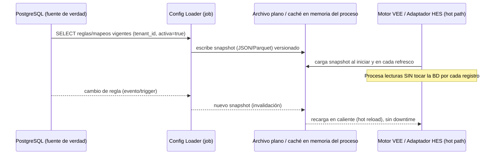
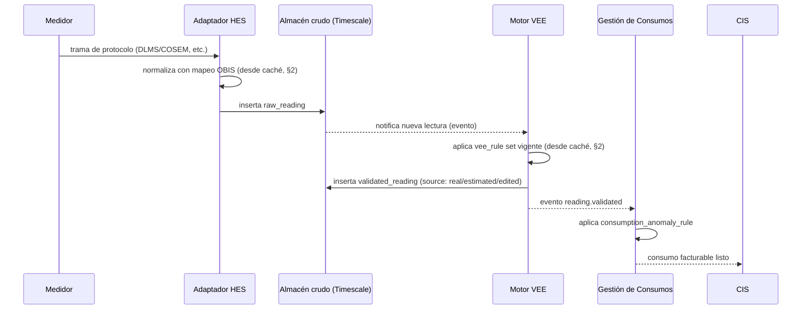
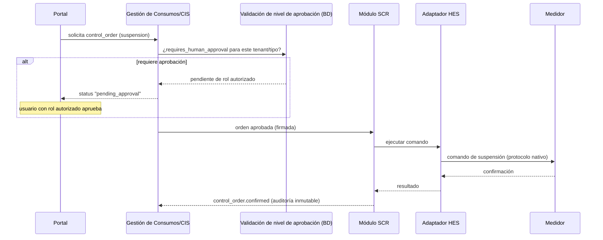
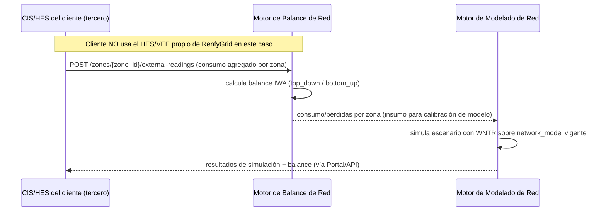
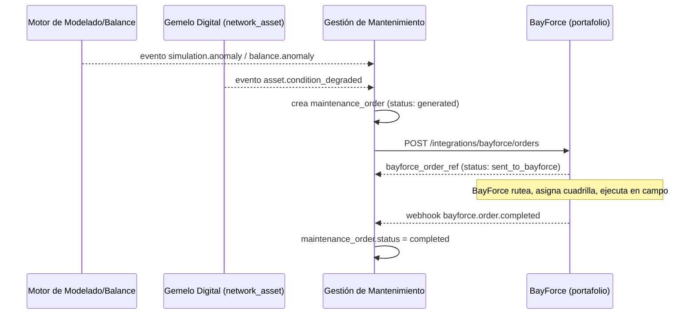

# Diseño — RenfyGrid (MDM/AMI)

**Fecha:** 2026-09-09 · **Estado:** Fase 3 de 4 (Planteamiento ✅ → Arquitectura general ✅ → **Diseño** → Plan de sprints)

**Principio de diseño obligatorio para todo el proyecto (pedido explícito del usuario):**
**cero datos hardcodeados.** Todo valor que pueda variar por tenant, por marca de medidor,
por protocolo o por regulación (umbrales VEE, mapeos de protocolo, reglas de crítica, roles,
niveles de aprobación de control) vive en **base de datos** como fuente de verdad. Para los
procesos de **alto desempeño** (motor VEE, adaptadores HES procesando telemetría en tiempo
real) esa configuración se **cachea en memoria/archivo plano local**, refrescada desde la BD
— así el hot path nunca hace un round-trip a la base de datos por cada lectura, pero tampoco
hay un solo valor fijo en el código fuente. Este patrón se detalla en §2.

---

## 1. Modelo de datos detallado

Extiende las entidades núcleo de la Fase 2 (`02-arquitectura-general.md` §4) con las tablas
de **configuración** que reemplazan cualquier valor que antes se hubiera hardcodeado.

### 1.1 Configuración (fuente de verdad — nunca en código)

```sql
tenant (
  id, name, plan, is_active,
  config          -- overrides puntuales por tenant
)

meter_protocol (
  id, tenant_id, brand, model, protocol,   -- ej: 'DLMS_COSEM', 'ANSI_C12_19'
  obis_mapping,       -- mapeo de códigos OBIS/registros -> campos internos
  security_mode,        -- nivel de cifrado/autenticación soportado por el medidor
  version, valid_from
)

vee_rule (
  id, tenant_id, type,        -- 'range' | 'deviation' | 'missing_interval' | 'spike'
  params,            -- ej: {"max_deviation_pct": 2, "min_value": 0}
  priority, is_active, version, valid_from
)

consumption_anomaly_rule (
  id, tenant_id, condition, action         -- 'inspection_order' | 'reread_order'
)

control_approval_level (
  id, tenant_id, order_type,   -- 'suspension' | 'reconnection' | 'disconnection'
  requires_human_approval, min_required_role
)

role_permission (id, tenant_id, role, permission)
```

### 1.2 Datos operativos (ya definidos en Fase 2, sin cambios de fondo)

```
meter, gateway, raw_reading (hypertable Timescale),
validated_reading, meter_event, control_order, consumption
```

### 1.3 Balance de Red y Modelado de Red (agregado 2026-09-10)

```sql
network_zone (
  id, tenant_id, name, type,          -- 'dma' | 'circuit' | 'district' | 'pressure_zone'
  parent_zone_id,                         -- jerarquía (zona dentro de zona)
  data_source                            -- 'renfygrid' | 'external' (ver §3, ingesta externa)
)

network_balance (
  id, tenant_id, zone_id, period,       -- daterange
  inflow, authorized_consumption, losses, -- unidades según utility (m3, kWh, m3 gas)
  method,                                -- 'top_down' | 'bottom_up'
  version, calculated_at
)

network_model (
  id, tenant_id, name, format,        -- 'epanet_inp' (agua); otros formatos a futuro
  version, valid_from, file_ref    -- referencia a almacenamiento de archivos del modelo
)

simulation_result (
  id, tenant_id, network_model_id, scenario,
  results, calculated_at
)
```

`network_balance` y `network_model` **no dependen de que exista un `meter` en RenfyGrid** — pueden
poblarse a partir de `data_source = 'external'` (ver el endpoint de ingesta externa en §3), que
es justo lo que permite venderlos como módulo suelto (`01-planteamiento.md` §3, principio de
modularidad).

### 1.4 Gemelo Digital y Gestión de Mantenimiento (agregado 2026-09-10)

```sql
network_asset (
  id, tenant_id, zone_id, type,     -- 'pipe'|'valve'|'tank'|'pump'|'meter'|'sensor'
  attributes,                   -- material, diameter, capacity, install_year, etc.
  geometry,                        -- PostGIS (point/linestring) -- mismo Postgres, sin motor SIG aparte
  status,                           -- 'operational'|'out_of_service'|'maintenance'
  version, valid_from            -- versionado, igual patrón que vee_rule/meter_protocol
)

asset_connectivity (
  source_asset_id, target_asset_id, connection_type   -- el grafo de topología del gemelo digital
)

maintenance_order (
  id, tenant_id, asset_id,
  type,             -- 'preventive' | 'corrective' | 'inspection'
  source,           -- 'asset_condition' | 'simulation_result' | 'balance_anomaly' | 'manual'
  status,           -- 'generated' -> 'sent_to_bayforce' -> 'in_progress' -> 'completed' | 'cancelled'
  bayforce_order_ref,   -- id de la orden espejo en BayForce, una vez integrada
  created_at
)
```

`network_asset` es la fuente de verdad del **Gemelo Digital**: `network_model` (§1.3) deja de ser un
archivo `.inp` aislado y pasa a poder **derivarse** de `network_asset` + `asset_connectivity`
(exportar a formato EPANET) en vez de cargarse a mano — aunque la carga directa de un `.inp`
sigue soportada para clientes que ya tienen el modelo hecho y solo quieren Modelado de Red sin
Gemelo Digital completo (modularidad, `01-planteamiento.md` §3).

**Regla de trazabilidad**: `vee_rule`, `meter_protocol` y `control_approval_level`
son **versionadas** (`version`, `valid_from`) — nunca se actualiza una fila en sitio,
se inserta una versión nueva. Así toda lectura validada queda ligada a la versión de regla
que efectivamente se le aplicó (auditable, reproducible).

### 1.5 RLS: dos requisitos que las políticas por sí solas no cubren (verificado con un fallo real, 2026-09-10)

La primera verificación end-to-end de RLS (`infra/db/verify_rls.py` contra Postgres real)
**falló**: un tenant veía los datos de otro a pesar de que las políticas de arriba estaban
bien escritas. Causa raíz — dos reglas de Postgres que ninguna política declarativa puede
compensar:

1. **Un rol superusuario siempre se salta RLS**, sin importar las políticas. La aplicación
   debe conectarse con un rol dedicado, sin privilegios de superusuario — nunca con el rol
   que corrió las migraciones. Ver `infra/db/migrations/0002_app_role.sql` (`renfygrid_app`).
2. **El dueño de la tabla también se salta RLS**, salvo que la tabla tenga
   `FORCE ROW LEVEL SECURITY` además de `ENABLE ROW LEVEL SECURITY`. Las 13 tablas con
   `tenant_id` llevan ambas (`0001_init.sql`).

Ninguna de las dos correcciones es opcional ni "defensa en profundidad cosmética" — sin
ambas, el aislamiento entre tenants simplemente no existe, aunque las políticas estén
perfectas. Verificado limpio (exit code 0) con los archivos de migración definitivos — ver
`docs/05-ejecucion.md` bitácora.

## 2. Patrón "configuración cacheada" para procesos de alto desempeño

Aplica a: **motor VEE** y **adaptadores HES** (los dos puntos que procesan volumen alto en
tiempo real).



- **Fuente de verdad**: siempre la BD — nunca se edita el archivo plano a mano.
- **Refresco**: por evento (la BD notifica cambio vía `LISTEN/NOTIFY` de Postgres o un mensaje
  en el bus) — no por polling constante, para no perder el beneficio de performance.
- **Formato del snapshot**: JSON para reglas VEE y mapeos de protocolo (se leen pocas veces
  por segundo, tamaño pequeño); si el volumen de mapeos crece mucho (muchas marcas/modelos),
  se evalúa Parquet/SQLite embebido de solo lectura como snapshot en vez de JSON plano.
- **Ningún umbral, mapeo OBIS, ni regla de negocio se escribe en el código fuente** de los
  servicios — todo llega por este mecanismo.

## 3. Contratos de API entre servicios

Todos los servicios exponen REST interno (JSON) + eventos en el bus para lo asíncrono.

| Servicio | Endpoint / Evento | Propósito |
|---|---|---|
| Adaptador HES | `POST /readings` (interno, alta frecuencia) | Publica lectura normalizada cruda hacia Almacén |
| Adaptador HES | `POST /commands/{order_id}/execute` | Recibe orden de control ya aprobada, la traduce al protocolo del medidor |
| Adaptador HES | evento `meter.event` | Alarma/tamper detectado en campo |
| Motor VEE | evento `reading.validated` / `reading.rejected` | Resultado del pipeline VEE, consumido por Gestión de Consumos |
| Gestión de Consumos | `GET /consumption/{meter_id}?period=` | Consulta de consumo facturable |
| Gestión de Consumos | `POST /control-orders` | Solicita una orden de control (valida rol + nivel de aprobación desde BD) |
| Módulo SCR | evento `control_order.confirmed` / `.failed` | Estado final de una orden, hacia CIS/Portal |
| Portal/API pública | `GET /meters`, `GET /events`, `POST /control-orders` | Único punto de entrada multi-tenant (RLS aplicado por el JWT del tenant) |
| Motor de Balance de Red | `POST /zones/{zone_id}/external-readings` | **Ingesta externa** — permite alimentar el balance sin pasar por el HES propio (venta modular, ver `01-planteamiento.md` §3) |
| Motor de Balance de Red | `GET /balance/{zone_id}?period=` | Consulta de balance calculado (entrada, consumo autorizado, pérdidas) |
| Motor de Modelado de Red | `POST /models` (multipart, archivo `.inp`) | Sube/versiona un modelo hidráulico |
| Motor de Modelado de Red | `POST /models/{model_id}/simulate` | Corre una simulación (WNTR) y guarda `simulation_result` |
| Gemelo Digital | `POST /assets` / `POST /assets/{id}/connectivity` | Alta/actualización de activos y topología (propio o sincronizado desde el SIG del cliente) |
| Gestión de Mantenimiento | evento `asset.condition_degraded` / `simulation.anomaly` / `balance.anomaly` | Dispara la generación automática de una `maintenance_order` |
| Gestión de Mantenimiento | `POST /integrations/bayforce/orders` | Entrega la orden a BayForce (ver `bayforce_order_ref`) |
| Gestión de Mantenimiento | webhook `bayforce.order.completed` (entrante) | BayForce confirma ejecución en campo; cierra la `maintenance_order` |

## 4. Diagramas de secuencia

### 4.1 Flujo de lectura (Meter to Cash)



### 4.2 Flujo de control (SCR) con aprobación



### 4.3 Flujo de Balance de Red — venta modular con datos externos



Este es el flujo que usaría un cliente que compra **solo** Balance de Red + Modelado de Red
(ej. una utility grande que ya tiene su propia medición/CIS) — contrasta con el flujo 4.1, que
asume el paquete completo con HES propio.

### 4.4 Flujo de mantenimiento — Gemelo Digital → BayForce



RenfyGrid nunca construye ruteo, asignación de cuadrillas ni app móvil de campo — esa
responsabilidad completa vive en BayForce (`02-arquitectura-general.md` §1, principio 7).

## 5. Diseño del motor VEE (detallado)

Reglas por etapa, **todas parametrizadas en `vee_rule`** (nada fijo en código):

- **Validación**: rango min/max por tipo de lectura, formato, coherencia entre canales
  (activa/reactiva), integridad referencial contra `meter`.
- **Estimación**: método configurable por tenant (`linear_interpolation`,
  `customer_historical_average`, `similar_customers_average`) — el método es un parámetro
  de `vee_rule.params`, no un `if` en el código.
- **Edición**: manual, siempre con `user_name`, `previous_value`, `new_value`,
  `justification` — registro no editable (append-only).

**Historias de usuario base** (generalizadas del prototipo conceptual, sin datos de ningún
cliente puntual):

1. Como operador VEE, quiero que el sistema marque automáticamente lecturas fuera del rango
   configurado para el tenant, para revisarlas antes de facturar.
2. Como operador VEE, quiero que el sistema estime lecturas faltantes según el método
   configurado (no fijo), para no interrumpir la continuidad de facturación.
3. Como operador VEE, quiero editar manualmente una lectura marcada como errónea, dejando
   registro de quién y por qué, para poder auditar el cambio después.
4. Como administrador, quiero cambiar un umbral de validación sin desplegar código, para
   ajustar la sensibilidad del sistema por tenant o por temporada.

## 6. Diseño del flujo de aprobación de control (SCR)

- `control_approval_level` decide, **por tenant y por tipo de orden**, si se requiere
  aprobación humana antes de ejecutar.
- Estados de `control_order`: `requested → pending_approval → approved → sent →
  confirmed | failed`.
- Cualquier transición queda en auditoría inmutable (igual patrón que la edición VEE).
- Nada de "todas las reconexiones se auto-aprueban" ni "todas requieren aprobación" fijo en
  código — es una fila configurable en BD por tenant, resuelto en el planteamiento (Fase 1
  §7, punto 3) al momento de definir el piloto.

## 7. Diseño de Balance de Red y Modelado de Red (agregado 2026-09-10)

- **Balance de Red**: implementa la metodología IWA (International Water Association)
  Top-Down (desde la fuente hacia el cliente) y Bottom-Up (desde el consumo medido hacia
  arriba) — el mismo estándar de la industria que usan las soluciones especializadas de
  mercado. El método (`top_down`/`bottom_up`) y las unidades son parámetros de `network_balance`,
  no un cálculo fijo — el mismo motor sirve para agua (m³), energía (kWh) o gas (m³), con las
  fórmulas de pérdida ajustadas por tipo vía configuración, no por rama de código separada.
- **Modelado de Red**: `network_model` es versionado igual que `vee_rule`/`meter_protocol`
  (nunca se sobrescribe un modelo en sitio). El motor no reimplementa el solver hidráulico —
  delega en WNTR (`02-arquitectura-general.md` §3.2), y el trabajo propio es la gestión del
  ciclo de vida (subir, versionar, vincular a `network_zone`, correr y guardar simulaciones).
- **Modularidad en la práctica**: ambos motores leen tanto de `validated_reading` (pipeline
  interno) como de datos insertados vía `/external-readings` — el modelo de datos no
  distingue el origen más allá del campo `data_source` en `network_zone`, así que no hace falta
  una versión "light" separada del producto para venderlo suelto.

## 8. Diseño de Gemelo Digital y Gestión de Mantenimiento (agregado 2026-09-10)

- **Gemelo Digital = `network_asset` + `asset_connectivity`**, no un concepto aparte — es el
  inventario operativo vivo de la red. Cada activo es versionado (igual que `vee_rule`), así
  que un cambio de estado (ej. una válvula que pasa a "fuera de servicio") queda trazable.
- **Sincronización con SIG del cliente**: `network_asset` acepta ingesta externa igual que
  `network_zone` — un cliente que ya tiene su SIG no necesita migrar su catastro de activos a
  RenfyGrid para usar Modelado de Red o Gestión de Mantenimiento.
- **Gestión de Mantenimiento no decide qué hacer en campo** — solo decide **que hay que hacer
  algo** (a partir de condición de activo, resultado de simulación, o anomalía de balance) y
  genera la `maintenance_order`. Todo lo operativo de ejecutarla (a quién asignarla, la ruta,
  la confirmación en sitio) es responsabilidad de BayForce vía la integración de §3/§4.4.
- **Historias de usuario base**:
  1. Como ingeniero de red, quiero que una anomalía detectada en el balance o la simulación
     genere automáticamente una orden de mantenimiento, para no depender de que alguien la
     note manualmente.
  2. Como administrador, quiero configurar qué tipo de anomalía genera qué tipo de orden
     (preventivo/correctivo/inspección) por tenant, sin que sea una regla fija en código.
  3. Como operador, quiero ver en RenfyGrid el estado de una orden que ya se envió a BayForce
     (enviada → en ejecución → completada), sin tener que entrar a dos sistemas distintos.

## 9. Diseño del Portal Web (agregado 2026-09-10)

Ver la decisión de arquitectura y las fuentes de la investigación en
`02-arquitectura-general.md` §9. Esta sección detalla lo que falta para construirlo: el
usuario real (gap encontrado), los contratos de API nuevos, y las pantallas.

### 9.1 Usuario real (gap nuevo, no existía)

```sql
app_user (
  id, tenant_id, email, password_hash,   -- hash, nunca la contraseña en texto plano
  role,           -- mismo valor que ya usa role_permission/control_approval_level.min_required_role
  is_active,
  created_at
)
```

`POST /auth/login` (nuevo endpoint del Portal/API, Sprint 8 existente): recibe
`{email, password}`, valida contra `app_user` (dentro del tenant que ese email pertenece — el
login es el único endpoint que *no* recibe el tenant por JWT, porque todavía no hay uno), emite
un JWT igual al que ya usa `renmeter_common/auth.py` (Sprint 0) con `tenant_id`/`role` como
claims. El resto de endpoints no cambia — siguen exigiendo ese JWT exactamente como ya lo hacen
desde Sprint 8.

### 9.2 Contratos de API nuevos para el Portal Web

| Endpoint | Método | Devuelve |
|---|---|---|
| `/auth/login` | POST | JWT (ver 9.1) |
| `/dashboard/overview` | GET | Nivel 1: conteos por etapa — medidores activos/caídos (reusa `observability.ingestion_metrics`), lecturas VEE inválidas pendientes, consumos en revisión, órdenes de control pendientes de aprobación |
| `/vee-rules` | GET/POST/PATCH | Editor de reglas VEE (9.3) — lista, crea una nueva versión, desactiva una vigente (nunca `DELETE`: `vee_rule` es versionado, `valid_to` cierra una versión, no se borra) |
| `/consumption-anomaly-rules`, `/control-approval-levels` | GET/POST/PATCH | Mismo patrón que `/vee-rules`, misma naturaleza de tabla versionada |

Los endpoints que ya existían (Sprint 8-10: `/meters`, `/consumption`, `/events`,
`/control-orders`, `/observability/ingestion`, `/billing-export`) no cambian — el Portal Web es
un cliente nuevo de esa misma API, no un rediseño de ella.

### 9.3 Editor de reglas (pedido explícito del usuario)

Una pantalla de **Configuración**, no ligada a una etapa del pipeline — administra las 3 tablas
de configuración versionada que hoy solo se editan por SQL directo (`vee_rule`,
`consumption_anomaly_rule`, `control_approval_level`). Mismo patrón para las tres: listar
versiones vigentes, crear una nueva (queda `valid_from = now()`), y al crear una nueva para el
mismo `(tenant_id, type/order_type)` la anterior se cierra (`valid_to = now()`) — igual que ya
hace el patrón de configuración cacheada (`03-diseno.md` §2), el editor no inventa un mecanismo
de versionado nuevo, usa el que ya existe.

### 9.4 Pantallas (jerarquía de 3 niveles, ver `02-arquitectura-general.md` §9)

| Nivel | Pantalla | KPIs / contenido | Acción disponible |
|---|---|---|---|
| 1 | **Overview** | Tablero general: medidores activos/caídos, % lecturas a tiempo, lecturas VEE inválidas, consumos en revisión, órdenes pendientes de aprobación — cada tile con su ícono de alerta si hay algo que atender | Navega a la pantalla de Nivel 2 de esa etapa |
| 2 | **Medidores / HES** | Lista de medidores con estado (activo/caído), última lectura, fallas de comunicación 24h (`meter_event`, F09) | Ver detalle (Nivel 3), forzar lectura bajo demanda (F04) |
| 2 | **Validación (VEE)** | Cola de `validated_reading` con `is_valid=false`, filtrable por `vee_rule_id` | Editar manualmente (F18, ya construido) |
| 2 | **Consumos** | Cola de `consumption` con `anomaly_status='under_review'` | Ver detalle, marcar resuelto |
| 2 | **Control (SCR)** | Cola de `control_order` en `pending_approval` + historial | Aprobar/rechazar (F27, ya construido) |
| 2 | **Observabilidad** | Igual a `GET /observability/ingestion` (F34, ya construido) | — |
| — | **Configuración** (transversal, no es una etapa) | Editor de reglas (9.3) | Alta de nueva versión de regla |
| 3 | **Detalle** | El registro puntual (un medidor, una lectura, una orden) con su historial de auditoría completo | La acción de esa entidad (aprobar, editar, reintentar) |

## 10. Próximos pasos

Con el modelo de datos, contratos de API y flujos de secuencia definidos, se pasa a la
**Fase 4: Plan de desarrollo ágil por sprints** — desglose en épicas/historias priorizadas,
definición del MVP del piloto (qué protocolo, qué tenant, qué alcance de VEE/SCR entra en el
primer incremento), y estimación de sprints. El plan de sprints del Portal Web (nuevo track)
se detalla en `04-plan-sprints.md` §9.
